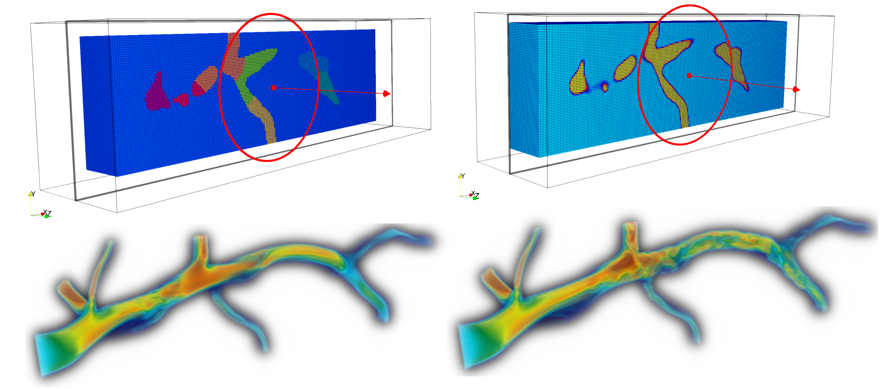
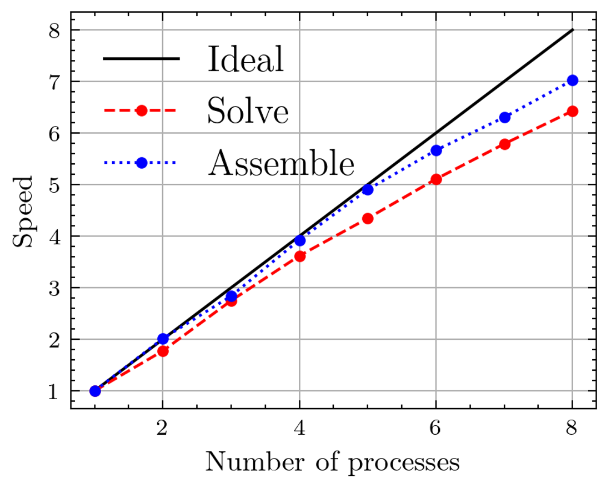

# 4D-Var
## Overview
This C++ code supports both foward and inverse analyses in CFD using the Message Passing Interface (MPI). The inverse routine addresses forward and adjoint equations to optimize control variables, including the inlet Dirichlet boundary condition and the initial velocity field. These physical equations are discretized on an orthogonal grid employing the Finite Element Method (FEM).
## Dependencies
・PETSc: The Portable, Extensible Toolkit for Scientific Computation  
・METIS: Parallel Domain Partitioning  
・TextParser: Text Parsing Library for input  

See:  
https://petsc.org/release/  
https://github.com/KarypisLab/METIS  
https://github.com/avr-aics-riken/TextParser  

## Usage
    * sh build.sh
    * cd /<example_dir>
    * mpirun -n <process> ./<solver_dir>/<solver_name> <tp_name>.tp petsc_options.dat
## Applications
・**UnsteadyNavierStokesSolver**: Solves Unsteady Navier-Stokes equation.  
・**4DVar (Four-Dimensional Variational Data Assimilation)**: Solves inverse problem.   
## Examples
&nbsp;&nbsp;&nbsp; Foward Solver (8 MPI Processes)  
  
&nbsp;&nbsp;&nbsp; Example - MPI Performance  
  