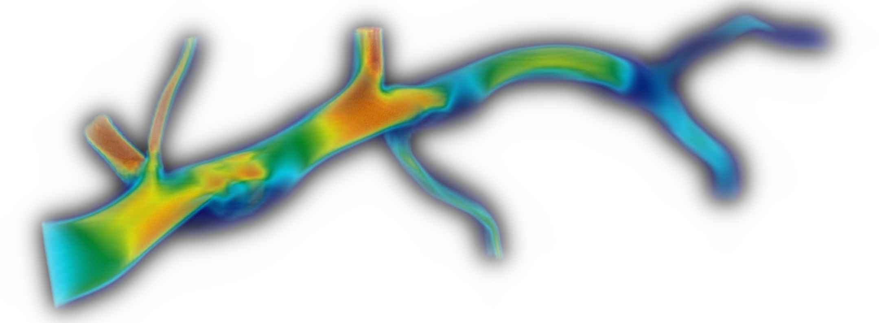
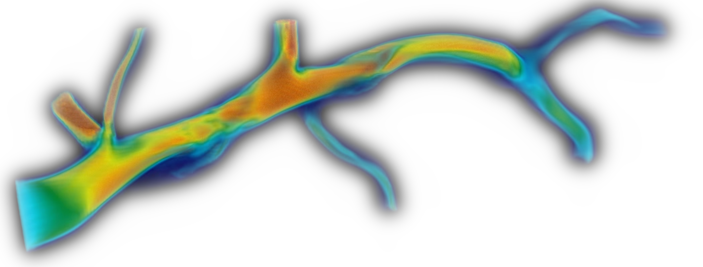
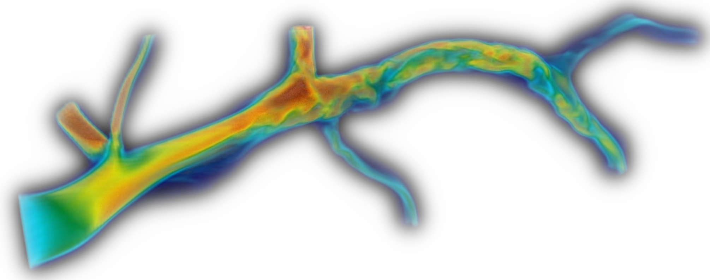

# 4D-Var
## Overview
4D-Var (Four-Dimensional Variational Data Assimilation) is a parallel computing-based framework for solving both direct and inverse problems in fluid dynamics.
This project mainly focuses on simulating blood flow based on MRI measurements.
The governing equations are discretized on an orthogonal grid using the Finite Element Method (FEM).

## Installation

### 1. Clone the repository
```bash
git clone https://github.com/KakeruUeda/4D-Var.git
```
### 2. Build the project
```bash
* sh build.sh
* cd /<example_dir>
* mpirun -n <num_of_processes> ./<solver_dir>/<solver_name> <tp_name>.tp petsc_options.dat
```

## Features
・example/direct/usns: Direct solver for the Unsteady Navier–Stokes equations.
<br>
・example/inverse/4dvar: Inverse solver for the unsteady Navier–Stokes equations.

## Documents
See: https://github.com/KakeruUeda/4D-Var-Document.git


## Examples

・Direct Simulation: Flow through a vessel

<p>
  <br>
  <br>
  
</p>