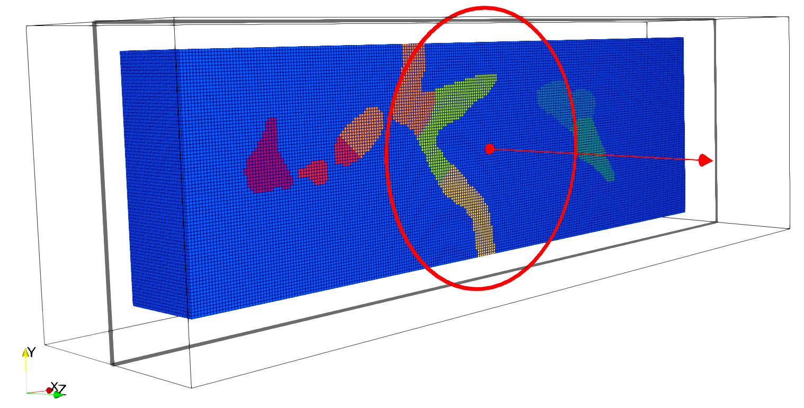
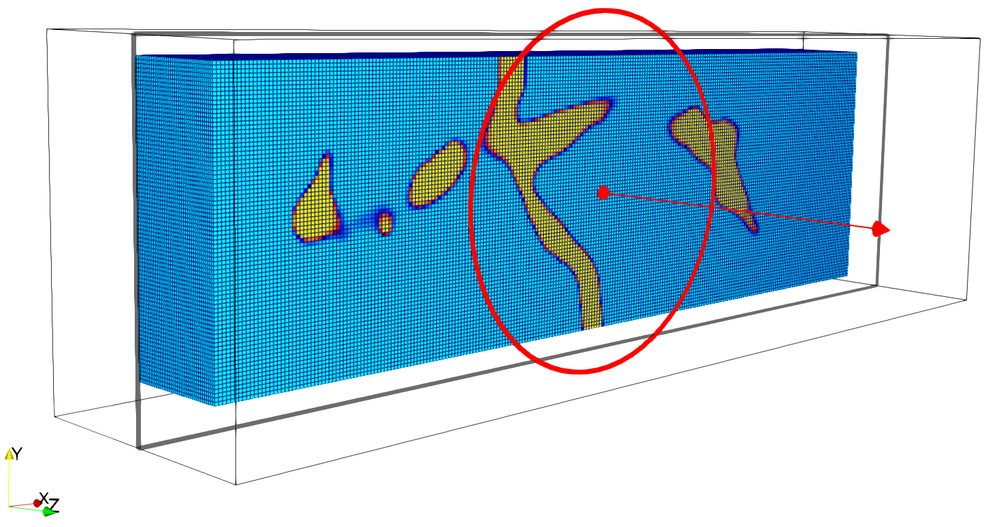

# 4D-Var
## Overview
This C++ code supports both direct and inverse analyses in CFD. 
## Dependencies
・METIS: Parallel Domain Partitioning  
・PETSc: The Portable, Extensible Toolkit for Scientific Computation  
・TextParser: Text Parsing Library for input  
## Usage
    * sh build.sh
    * cd /<example_dir>
    * mpirun -n <process> ./<solver_dir>/<solver_name> <tp_name>.tp petsc_options.dat
## Applications
・**Strgrid**: Create structured grid  
・**UnsteadyNavierStokesSolver**: Solve Unsteady Navier-Stokes  
&nbsp;&nbsp;&nbsp; **Example - 8 MPI Processes**  
&nbsp;&nbsp;&nbsp;　
  
&nbsp;&nbsp;&nbsp;　

  
・**4DVar**: Four-Dimensional Variational Data Assimilation  
・**FlowRate, MAE**: 4DVar postproces  